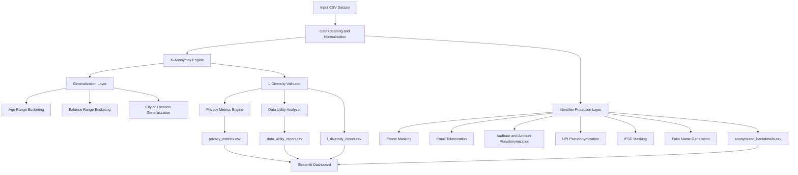
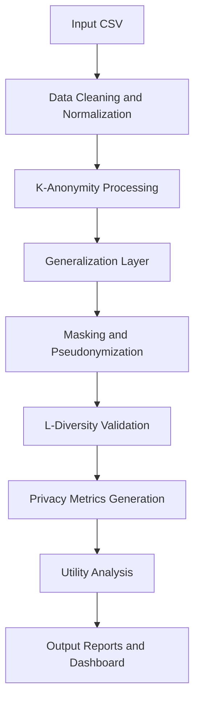
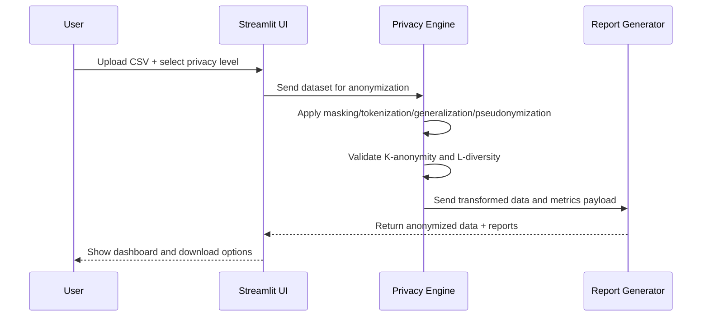

# Financial Data Anonymization System

<p align="center">
  <b>Privacy-first financial data transformation pipeline for secure analytics and responsible AI workflows.</b>
</p>

<p align="center">
  
  
  
  
  
</p>

---

## 📌 Project Overview

### Problem Statement
Financial datasets often contain personally identifiable information (PII) and sensitive attributes such as Aadhaar numbers, account numbers, phone numbers, and precise balances. Sharing such data directly can lead to re-identification risks, privacy breaches, and regulatory non-compliance.

### Why Data Anonymization Matters
- Protects customer identity and financial confidentiality.
- Enables safe analytics, reporting, and experimentation.
- Reduces legal and compliance risk in data sharing.
- Supports privacy-aware AI/ML and data engineering workflows.

### Real-World Use Cases
- Secure dataset sharing across internal analytics teams.
- Privacy-preserving academic/research datasets.
- Demo and sandbox data for fintech product development.
- Compliance-focused data governance pipelines.

---

## 🧾 Version Information

### Current Version
- v1.0

### Major Features
- K-Anonymity
- L-Diversity
- SHA-256 Pseudonymization
- Data Utility Analysis
- Streamlit Dashboard
- Privacy Compliance Reporting

## 🛣️ Future Roadmap

### Version 2.0 Goals
- Differential Privacy
- T-Closeness
- Database Integration
- REST API Support
- Role-Based Access Control
- Cloud Deployment
- Real-Time Data Processing

---

## ✨ Key Features

- 🔒 **K-Anonymity (K=10):** Generalizes age into ranges so each group has minimum record support.
- 🧩 **L-Diversity:** Validates diversity of sensitive values across quasi-identifier groups.
- 💰 **Balance Generalization:** Converts exact balance into INR ranges.
- 📱 **Phone Masking:** Reveals only last 4 digits.
- 📧 **Email Tokenization:** Replaces emails with stable tokens.
- 🔐 **SHA-256 Pseudonymization:** Protects Aadhaar and account identifiers.
- 🏦 **IFSC Masking:** Preserves prefix while masking remaining characters.
- 👤 **Fake Name Generation:** Replaces real names with synthetic names using Faker.
- 🗺️ **Location Generalization:** Maps city-level identifiers to broader location representation.
- 📊 **Privacy Metrics Dashboard:** Compliance and risk-reduction metrics.
- 📈 **Data Utility Analysis:** Quantifies utility retention after anonymization.
- 🌐 **Streamlit UI:** Upload, anonymize, inspect results, and download outputs.

---

## 🔐 Security Features

- 🔐 **SHA-256 Based Pseudonymization:** Secures high-risk identifiers with deterministic hashing.
- 📱 **Phone Number Masking:** Reveals only the last 4 digits of phone numbers.
- 📧 **Email Tokenization:** Replaces email addresses with stable surrogate tokens.
- 🪪 **Aadhaar Anonymization:** Protects Aadhaar numbers from direct exposure.
- 💳 **Account Number Protection:** Masks or pseudonymizes account identifiers.
- 🧾 **UPI Identifier Protection:** Secures UPI IDs during data transformation.
- 🗺️ **Location Generalization:** Converts city-level values into broader location categories.
- 📏 **K-Anonymity Enforcement:** Ensures each record remains indistinguishable within a minimum group size.
- 🧠 **L-Diversity Validation:** Verifies sensitive attribute diversity across grouped records.
- 📊 **Privacy Compliance Reporting:** Generates evidence of privacy controls and risk reduction.

---

## 🛡️ Protected Data Fields

The system automatically protects the following sensitive fields during anonymization:

- Name
- Phone Number
- Email Address
- Aadhaar Number
- Account Number
- UPI ID
- IFSC Code
- City / Location
- Account Balance

Protection methods include masking, tokenization, pseudonymization, hashing, and generalization.

---

## 📊 Processing Statistics

The anonymization pipeline supports:

- 10,000+ financial records processed in a single workflow.
- 8+ protected sensitive attributes, including identifiers and contact fields.
- K-Anonymity with a default value of K=10.
- L-Diversity with a default value of L=2.
- SHA-256 based pseudonymization for high-risk identifiers.
- Automated privacy and utility reporting for each anonymization run.

### Reporting Coverage

- Total records processed.
- Records modified during anonymization.
- Sensitive fields protected.
- Re-identification risk reduction percentage.
- K-Anonymity compliance status.
- L-Diversity compliance status.
- Utility preservation metrics for balance, age, and gender distributions.

---

## 🏗️ System Architecture



### Data Flow Summary
1. Raw records are cleaned and normalized.
2. Quasi-identifiers are generalized to reduce uniqueness.
3. Direct identifiers are masked, tokenized, or pseudonymized.
4. L-Diversity is validated on grouped records.
5. Privacy and utility reports are generated.
6. Outputs are visualized and exported through Streamlit.

## 🔄 System Workflow



### Workflow Summary
1. Input CSV data is loaded into the pipeline.
2. Records are cleaned and normalized for consistent processing.
3. K-anonymity is applied to reduce re-identification risk.
4. Sensitive values are generalized, masked, or pseudonymized.
5. L-diversity is validated to check sensitive attribute variation.
6. Privacy metrics and utility analysis are generated.
7. Final reports and dashboard outputs are produced.

---

## 🗂️ Project Structure

```text
Data-annonymizatiom-in-Financial-system/
├── app.py
├── main.py
├── privacy_engine.py
├── requirements.txt
├── bankdetails.csv
├── anonymized_bankdetails.csv
├── README.md
├── docs/
│   ├── FULL_PROJECT_DOCUMENTATION.md
│   ├── INTERVIEW_REVISION_CHEATSHEET.md
│   ├── current_implementation_and_features.md
│   ├── interview_preparation_notes.md
│   ├── modification_walkthrough.md
│   ├── before_after_comparison.md
└── outputs/
```

---

## ⚙️ Installation Guide

### 1) Clone Repository
```bash
git clone https://github.com/<your-username>/Data-annonymizatiom-in-Financial-system.git
cd Data-annonymizatiom-in-Financial-system
```

### 2) Create Virtual Environment
```bash
python -m venv .venv
```

### 3) Activate Virtual Environment

**Windows (PowerShell):**
```bash
.\.venv\Scripts\Activate.ps1
```

**Linux/macOS:**
```bash
source .venv/bin/activate
```

### 4) Install Dependencies
```bash
pip install -r requirements.txt
```

### 5) Run Application

**CLI pipeline:**
```bash
python main.py
```

**Streamlit UI:**
```bash
streamlit run app.py
```

---

## 🚀 Usage Guide

1. Launch the Streamlit app.
2. Upload your financial CSV dataset.
3. Select privacy level (Low / Medium / High).
4. Run anonymization.
5. Review anonymized preview, privacy metrics, and utility report.
6. Download anonymized dataset and generated reports.

## 📥 Input Dataset Requirements

Your input CSV dataset must include the fields needed by the anonymization and validation pipeline.

### Required Fields

- Age
- Balance_INR

### Recommended Fields

- Name
- Phone
- Email
- Aadhaar_Number
- Account_Number
- UPI_ID
- IFSC
- City
- Gender

Datasets missing Age or Balance_INR will fail validation.

## 📌 Assumptions

The anonymization pipeline is designed with the following assumptions:

- Input datasets are structured CSV files.
- Age and Balance_INR fields are available.
- Aadhaar numbers contain 12 digits.
- Financial records are non-malicious and correctly formatted.
- City names match supported mappings.

## 🧪 Sample Input Dataset

| Name | Age | Phone | Email | Balance_INR |
|---|---|---|---|---|
| Arshad | 21 | 9876543210 | arshad@gmail.com | 234567 |
| Ali | 22 | 9123456789 | ali@gmail.com | 345678 |

The system automatically anonymizes sensitive information while preserving analytical utility.

---

## 🔄 Before vs After Examples

| Field | Before | After |
|---|---|---|
| Name | Sai Rathod | Synthetic Faker Name |
| Email | sairathod4770@gmail.com | email_000001 |
| Phone | 9238587648 | ******7648 |
| Aadhaar_Number | 949291000000 | 735200037737 (pseudonymized) |
| Balance_INR | 373914 | 370000-380000 |

---

## 🧠 Privacy Techniques Explained

<details>
<summary><b>K-Anonymity</b></summary>
Ensures each record is indistinguishable from at least K-1 others for selected quasi-identifiers. In this project, age is generalized into ranges to satisfy K support.
</details>

<details>
<summary><b>L-Diversity</b></summary>
Prevents homogeneity attacks by ensuring each quasi-identifier group has at least L distinct sensitive values.
</details>

<details>
<summary><b>Generalization</b></summary>
Replaces exact values with broader ranges/categories (example: exact balance to balance range) to reduce identifiability.
</details>

<details>
<summary><b>Tokenization</b></summary>
Replaces identifiers such as emails with stable surrogate tokens while preserving row-level consistency.
</details>

<details>
<summary><b>Pseudonymization</b></summary>
Transforms identifiers via SHA-256-based logic to reduce direct exposure while retaining analytical linkage.
</details>

## 🧠 Privacy Techniques Used

| Technique | Purpose |
|------------|------------|
| K-Anonymity | Prevent identity disclosure |
| L-Diversity | Prevent attribute disclosure |
| Masking | Hide sensitive values |
| Tokenization | Replace identifiers with tokens |
| Pseudonymization | Protect unique identifiers |
| Generalization | Reduce data granularity |
| SHA-256 Hashing | Secure identifier transformation |

---

## Frequently Asked Questions

### Why K-Anonymity?
To reduce re-identification risk by ensuring records are indistinguishable from at least K-1 other records.

### Why L-Diversity?
To prevent attribute disclosure within anonymized groups.

### Why Hashing?
To securely pseudonymize identifiers while preserving consistency.

### Why Generalization?
To reduce uniqueness while maintaining analytical value.

---

## 🖼️ Screenshots

> Add real screenshots before final portfolio submission.

- 
- 
- 
- 

---

## 🔁 Project Workflow Diagram



---

## 📦 Sample Output Artifacts

- `outputs/anonymized_bankdetails.csv`
- `outputs/l_diversity_report.csv`
- `outputs/privacy_metrics.csv`
- `outputs/data_utility_report.csv`

## Generated Reports

1. anonymized_bankdetails.csv
  - Final anonymized dataset

2. privacy_metrics.csv
  - Privacy effectiveness metrics

3. l_diversity_report.csv
  - Group-level diversity validation

4. data_utility_report.csv
  - Utility preservation analysis

Example metrics typically reported:
- Total records processed
- Records modified
- Sensitive fields protected
- Re-identification risk reduction percentage
- K-Anonymity compliance
- L-Diversity compliance

---

## 🛠️ Technical Challenges Solved

1. Balanced privacy and utility without over-anonymizing data.
2. Built deterministic yet readable transformations for multiple identifiers.
3. Added compliance-style reporting instead of only transformed output.
4. Converted a script into a modular pipeline reusable by both CLI and web app.
5. Enabled recruiter-friendly explainability with measurable outputs.

---

## Known Limitations

1. K-Anonymity alone cannot prevent attribute disclosure.
2. L-Diversity may not fully protect against skewness attacks.
3. City mapping relies on predefined mappings.
4. Large datasets may require performance optimization.
5. Differential Privacy is not currently implemented.

## 🔮 Future Improvements

- Differential Privacy
- T-Closeness
- Secure key management
- Database integration
- Real-time anonymization APIs

---

## 🎯 Learning Outcomes

- Applied practical anonymization techniques in a real data pipeline.
- Understood trade-offs between privacy guarantees and data utility.
- Built validation and reporting for privacy compliance evidence.
- Designed a user-friendly data privacy interface with Streamlit.
- Improved modular software design for maintainability and reuse.

---

## 🎤 Interview Highlights

### Concepts You Can Discuss
- Difference between anonymization, pseudonymization, and masking.
- Why K-Anonymity alone is insufficient and where L-Diversity helps.
- How to measure privacy impact and utility preservation quantitatively.
- Practical engineering decisions for finance domain privacy controls.

### Key Takeaways
- This project demonstrates end-to-end ownership: algorithm design, implementation, metrics, UI, and documentation.
- It shows both data privacy depth and software engineering maturity.

---

## 🤝 Contributing

Contributions are welcome.

1. Fork the repository.
2. Create a feature branch.
3. Commit your changes with clear messages.
4. Open a pull request with context and sample output.

For major changes, open an issue first to discuss design and scope.

---

## 📄 License

This project is licensed under the MIT License.

If you do not yet have a license file, add one before open-source distribution.

---

## 👨‍💻 Author

**Arshadali Athani**  
**Role:** Computer Science Engineering Student  
**Interests:** Data Analytics, Data Privacy, Cybersecurity

---

<p align="center">
  Built with a privacy-first mindset for secure data science and responsible software engineering.
</p>
